# PostgreSQL 面試練習庫（shop）

一間台灣電商「shop」的模擬資料，約 30 萬筆，彼此有關聯。

## 連線資訊

| 項目 | 值 |
|---|---|
| Host | localhost |
| Port | 5434 |
| Database | shop |
| User / Password | lab / lab |

```bash
docker exec -it pg-lab psql -U lab -d shop
```

圖形介面推薦 DBeaver 或 pgAdmin，填上面的連線資訊即可。

## 常用指令

```bash
docker compose up -d          # 啟動
docker compose stop           # 停止（資料保留）
docker compose down -v        # 刪掉資料庫，下次 up 會重新產生一模一樣的資料
```

## 資料表關聯

```mermaid
erDiagram
    customers   ||--o{ orders      : "customer_id"
    orders      ||--|{ order_items : "order_id"
    products    ||--o{ order_items : "product_id"
    categories  ||--o{ products    : "category_id"
    categories  ||--o{ categories  : "parent_id（上層分類）"
```



| 資料表 | 筆數 | 說明 |
|---|---:|---|
| customers | 20,000 | 會員 |
| orders | 80,000 | 訂單，2022-01 ~ 2026-09 |
| order_items | 約 200,000 | 訂單明細；小計 = `quantity * unit_price * (1 - discount)` |
| products | 1,500 | 商品；`specs` 是 JSONB 規格、`tags` 是 text[] 標籤 |
| categories | 27 | 三層分類樹，`parent_id` 指向自己這張表 |

## 刻意埋的「陷阱」（練習時會遇到）

- 1,629 位會員從沒下過單 → `LEFT JOIN`、`NOT EXISTS`
- 100 件新商品沒人買過；8 個上層分類底下沒有直接掛商品
- 部分欄位是 NULL：會員的生日 / 城市、最上層分類的 `parent_id`
- `categories.parent_id` 有 NULL → `NOT IN` 會查不到任何資料
- 商品有同價 → `RANK` / `DENSE_RANK` / `ROW_NUMBER` 差異
- 外鍵欄位沒建索引 → 之後用 `EXPLAIN ANALYZE` 比較加索引前後

## 索引實驗室的大表

`perf` schema 有兩張 200 萬筆的大表，不在上面 5 張表裡，專門用來比較各種索引：

- `perf.orders_big`：隨機順序寫入的訂單
- `perf.order_events`：依時間順序寫入的事件紀錄，`meta` 是 JSONB（示範 BRIN、GIN）

## 資料庫角色（最小權限）

| 角色 | 用途 | 權限 |
|---|---|---|
| `lab` | 連線帳號 | 超級使用者，只用來讀結構、管理連線 |
| `learner` | 執行使用者寫的 SQL | public 5 張表可讀寫（寫入沙盒一律 ROLLBACK）、perf 只能讀 |
| `perf_lab` | 索引實驗室建 / 刪索引 | 只擁有 perf schema |

## 展示台 APP

[db-showcase/](db-showcase/) 是 Spring Boot 寫的多資料庫展示台（http://localhost:8081），目前已串接 PostgreSQL：

| 分頁 | 內容 |
|---|---|
| 練習題 | 43 題，只給題目，自己寫 SQL；後端同時執行你的 SQL 與標準答案並比對結果。含 JSONB、Array、generate_series、RETURNING / UPSERT 寫入題 |
| 陷阱題 | 10 題，先猜結果再執行兩段 SQL 對照（LEFT JOIN 的 ON / WHERE、NOT IN 與 NULL、JSONB 文字比較…） |
| 寫入沙盒 | INSERT / UPDATE / DELETE，可以多句一起執行，最後一律 ROLLBACK |
| 索引實驗室 | 11 個步驟：B-tree、複合索引、Partial、Expression、BRIN、GIN，看 EXPLAIN ANALYZE 的變化 |
| 範例與自由查詢 | 示範查詢，或寫任何 SELECT |

題目內容放在 `db-showcase/src/main/resources/postgres/` 的 YAML 檔，加題目不用改程式。

```bash
cd db-showcase
mvn spring-boot:run
```

## 靜態網站（docs/）

`docs/` 是可以直接雙擊打開、也可以部署到 Render 的靜態網站，不需要資料庫：

| 檔案 | 內容 |
|---|---|
| `docs/index.html` | 首頁 |
| `docs/cheatsheet.html` | CheatSheet：目錄、搜尋、SQL 上色、一鍵複製 |
| `docs/question-bank.html` | 題庫：練習題、陷阱題、索引實驗，附答案與正確答案的實際執行結果 |

改了 `CHEATSHEET.md` 或題庫 YAML 之後，重新產生（展示台有在執行時，會順便更新執行結果）：

```bash
python tools/build_static.py
```

**部署到 Render**：New → Static Site → 選這個 repo，Publish Directory 填 `docs`，Build Command 留空或填 `echo ok`。
或用 New → Blueprint，會自動讀取 `render.yaml`。

## 學習路線

1. JOIN 進階：LEFT / RIGHT / FULL / SELF JOIN、NULL 的處理（`COALESCE`、`IS NULL`）
2. 子查詢與 `IN` / `EXISTS` / `NOT EXISTS`
3. `CASE WHEN`、條件彙總 `FILTER`
4. CTE（`WITH`）
5. 視窗函數：`ROW_NUMBER`、`RANK`、`LAG/LEAD`、累計加總、移動平均
6. 日期時間：`date_trunc`、`EXTRACT`、`interval`、月營收/留存率
7. 遞迴 CTE：組織樹、分類樹
8. 寫入：`INSERT ... ON CONFLICT`、`UPDATE ... FROM`、`DELETE`、`RETURNING`
9. 交易與鎖：`BEGIN/COMMIT/ROLLBACK`、隔離等級
10. 索引與效能：`EXPLAIN ANALYZE`、B-tree、複合索引
11. 設計：正規化、約束、View / Materialized View
